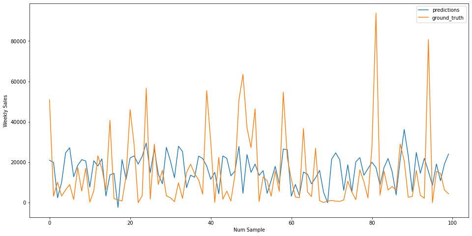
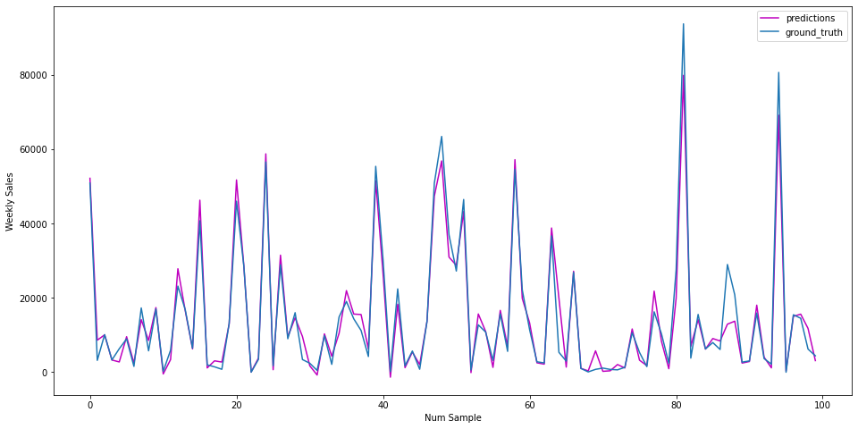

# Big-Data-Group16

This project is a part of the ITCS 6100 - Big Data Analytics for Competitive Advantage course from the University of North Carolina at Charlotte.

---
## Team Members
* Ankita Marathe
* Sanket Gaikwad
* Aniket Varade
* Sourabh Kumbhar
* Sandeep Chavan

---
## Communication plan
We plan to communicate 3 times per week through zoom or in-person meetings based on the availability of the group members. The meetings will last for 2-3 hrs each.

---
## Data Resource
There are four datasets provided by Walmart:
[Link for the dataset](https://www.kaggle.com/competitions/walmart-recruiting-store-sales-forecasting/data)

The dataset from Kaggle is used for this project. The dataset contains historical sales data from 45 stores located in different regions. Each store is further divided into departments. It has three different CSV files features, stores, and sales data.

|Column Name      | Description   |                                                                                        Type   |
|-----------------|-------------- |---------------------------------------------------------------------------------------------- |
|Store            | Numerical value indicating the store number                                                          |Integer |
|Dept             | The department number                                                                                |Integer|
|Date             |   Date indicating the week                                                                           | Date  | 
|Weekly_Sales|   Sales for the given department in the given store| Number|
|IsHoliday|  whether the week is a special holiday week |Boolean|
|Temperature| Average temperature in the region|Float|
|MarkDown| Anonymized data related to promotional markdowns that Walmart is running|Float|

---
## Business Problem or Opportunity, Domain Knowledge
* To forecast Walmart's weekly sales based on the past two years' sales on a weekly basis using AWS services (Sagemaker, Quicksight, and S3).
* To investigate how additional factors may influence weekly sales.
* To evaluate the different machine learning models as XGBoost and Linear Regression.
* To optimize the manufacturing process and therefore increase income while lowering costs.
* To understand customer demographics and analyze the weekly sales and observe trends in data.
* To bring valuable insights into pricing decisions on sales performance.

---
## Research Objective and Question
* What are the impacts of temperature, fuel prices, and various store promotions on weekly sales of different Walmart stores for two years?

---
## Data Preparation
The following three csv files are included in the dataset:

train.csv is a spreadsheet with 421570 rows and 5 columns. The columns include data for a store, department, date, weekly sales, and whether or not a given week is a holiday week.

store.csv is a 45-row, three-column spreadsheet. The columns correspond to the types of stores, as well as their sizes.

This file, features.csv, has 8190 rows and 12 columns. This file contains additional information on the stores as well as the regions in which they are located. It contains statistics for the date, temperature, gasoline price, consumer price index, and unemployment rate for the region in which a specific store is located.

* ###  Merging the dataset 
We have to merge the dataset into one dataframe.

* ### Extracting Date Information
 The sales are given for the Years 2012-2012 on weekly basis. So we have to split the date column to extract information for the year, month and week.

---
## Exploratory data analysis

The above dashboard indicates Negative Weekly Sales. It depicts the loss of revenue whereby product returns and rebates exceed actual product sales.

The above boxplot maps the sales of Walmart based on regular days and holidays. Here we can see that the holiday sales in November exceeded the regular day sales.

The above pie chart represents the percentage of sales of each store.

The above figure represents the monthly sales of Walmart for the years 2010 to 2012. From this, we can see that the months of November and December had the highest sales as compared to the other months.

The above boxplot represents sales of the Walmart stores for the years 2010, 2011, and 2012. Over the three years, 2010 had the highest sales. From 2011, the sales started decreasing indicating a negative trend.

### EDA using AWS Quicksight

The above dashboard indicates the missing values in our dataset. From this, we can observe that the Markdown columns have the largest amount of missing data which indicates that the products did not have any promotions or discounts.

The above barchart represents average sales of Walmart products according to the different store types. This shows that store type A has the highest average sales.

---
## Analytics and Machine Learning
To forecast Walmart's weekly sales, we have used Linear Regression and XGBoost (eXtreme Gradient Boosting) Regression algorithms using AWS Sagemaker.

Linear regression is a linear model that assumes a linear relationship between the input variables and the single output variable. It explains the relationship between one dependent variable and one or more independent variables. An observed data set of dependent and independent variables can be utilized to create a predictive model using linear regression. The fitted model can later be used to predict the outcome.

XGBoost is a high-speed and high-performance implementation of gradient boosted decision trees. In classification and regression predictive modeling challenges, it dominates structured or tabular datasets. Gradient boosting is a method that involves creating new models that forecast the residuals or mistakes of previous models, which are then combined to form the final prediction. When adding new models, it employs a gradient descent approach to minimize loss.

---
## Evaluation and Optimization
AWS Sagemaker provides libraries for predicting and tuning the parameters. We have imported the SKLearn library from the sagemaker.sklearn.estimator package for prediction and the HyperparameterTuner library from the sagemaker.tuner package for hyperparameter tuning.
For prediction, we have split the data into two separate files, train.csv and test.csv. We have split the data as 80% testing and 20% training. We have also performed hyperparameter tuning to get the best accuracy of the model. The hyperparameter tuner is using Bayes optimization and the best performing estimator will be deployed.
To compare the performance of the Linear Regression and the XGBoost models we have used the Root Mean Squared Error (RMSE) measure.

---
## Results
After employing and fitting the two models we compared their RMSE and R-Squared scores and observed that XGBoost was able to accurately predict Walmart's weekly sales than Linear Regression.

| Model             | Normalized RMSE | R-Squared |
| ----------------- | --------------- | --------- |
| Linear Regression | 0.9453          | 0.0912    |
| XGBoost           | 0.1888          | 0.9637    |

Linear Regression performance:

XGBoost performance:

---
## Future Work
For this project, we have done several visualizations to dig deeper into the dataset to find various correlations between the features and the target variable. The unique thing about our data is that we had to merge multiple data sets and perform imputations such as handling categorical values and converting the isHoliday feature to integer as the XGBoost model allows only numeric values. We also used the Date feature to derive other attributes like day, month, year, and week of the year. We used the RMSE and R-Squared measures to compare the performance of both models.

We further plan to predict the weekly sales of Walmart based on certain other parameters such as weather and expand our predictions for other locations as well.

### Instructions
1. Clone the repository.
2. From the Final Deliverable folder, start by opening the EDA.ipynb file and execute the Jupyter notebook to observe the various graphs and correlations between features.
3. Open the Train-Test Data.ipynb file and execute all the cells. This file generates the data-converted folder which will contain the train and test data.
4. Open and execute all the cells in the Train and Deploy.ipynb file to learn about the predictions.
